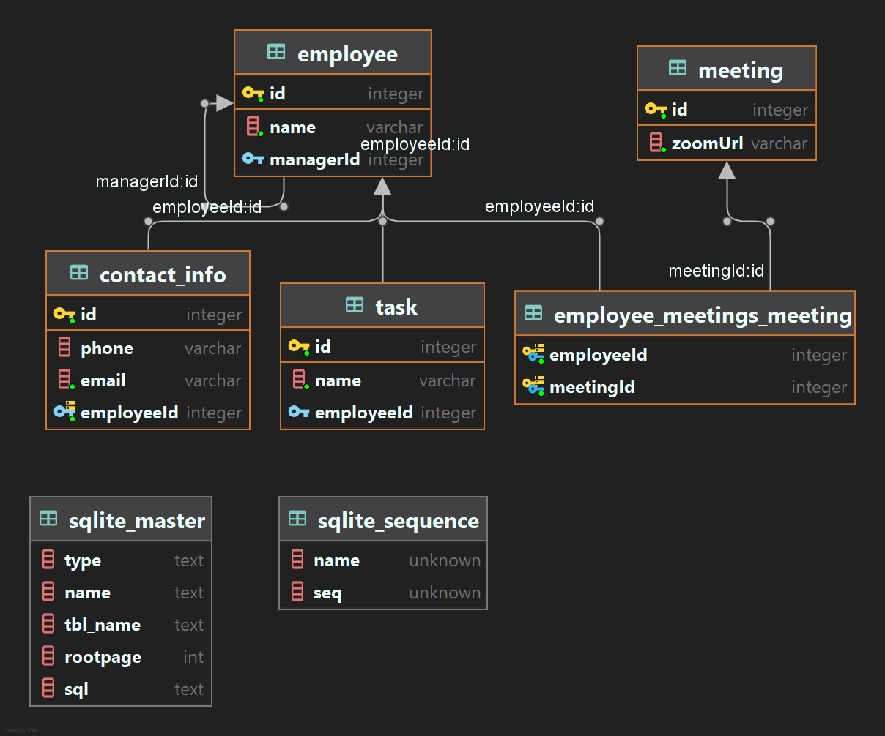

# TypeORM Relations (+ NestJS)

A practice repo on ORM relations.

The most interesting things are:
- `src/*.entity.ts` - entities and relations inside them
- ERD model (see the pic below)

### The tutorial source
[YouTube - Marius Espejo](https://www.youtube.com/watch?v=rKgZLVgdvAY&list=PLlaDAvA2MhR2jb8zavu6I-w1BA878aHcB&index=3)